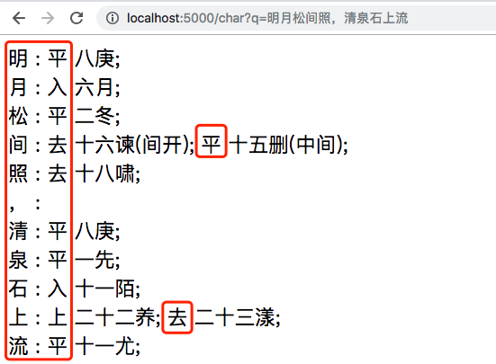
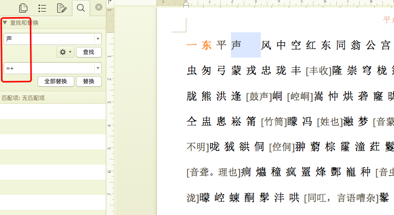
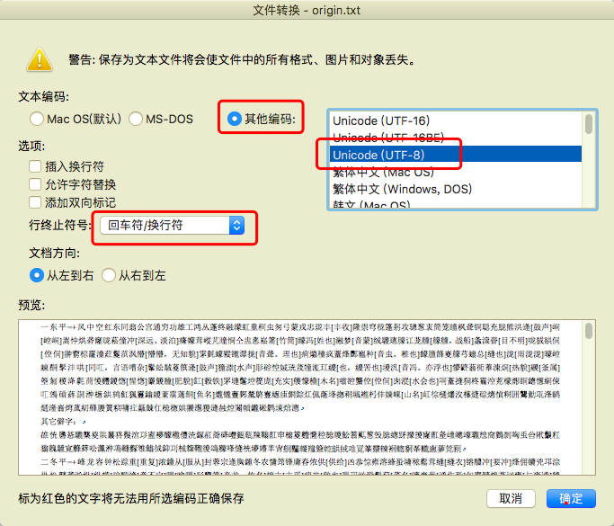

## 基于python的平水韵查询工具


本工具基于原始的平水韵文档，生成json格式的韵文表，并通过服务器提供查询接口。


### 一、使用方法

支持两种方式查询

* 使用终端命令查询
* 使用浏览器查询


平仄查询涉及的2个脚本：

* yunServer.py	用于启动查询服务端口
* load.sh 启动脚本，操纵yunServer.py


#### 1.1 启停服务

```shell
# git clone https://github.com/jkak/pingShuiYun.git
# cd pingShuiYun

# ./load.sh
usage ./load.sh [start|stop|status]

# ./load.sh start
started...

# ./load.sh status
python yunServer.py data/baseCharDict.json

started...

# ./load.sh stop

stoped...
```


#### 1.2 查询操作

终端查询

```shell
# search
curl "http://localhost:5000/char?q=明月松间照，清泉石上流"
明 : 平 八庚; <br>
月 : 入 六月; <br>
松 : 平 二冬; <br>
间 : 去 十六谏(间开); 平 十五删(中间); <br>
照 : 去 十八啸; <br>
， : <br>
清 : 平 八庚; <br>
泉 : 平 一先; <br>
石 : 入 十一陌; <br>
上 : 上 二十二养; 去 二十三漾; <br>
流 : 平 十一尤; <br>


```


浏览器查询：




### 二、生成操作

#### 2.1 原始文件

* 原始数据为word文档，来源于搜韵网。
* 下载链接：https://sou-yun.com/QR.aspx
* 最新版本链接为[平水韵20170714.doc](https://sou-yun.com/%e5%b9%b3%e6%b0%b4%e9%9f%b5.doc)，data/平水韵20170714.doc是本地镜像文件。


#### 2.2 转换操作

对原文件做如下操作：

* 将原文件copy出复本。
* 复本：删除开头的说明
* 复本：用word替换每个韵部开头**‘声 ’**（声及后面的空白符）换为'=+'。方便python处理。
* 拷贝复本：
  * 方法一：ctrl-C内容，在vi data/origin.txt文件中ctrl-V。
  * 方法二：word中另存为方式：
    * 存储文件选择：**纯文本.txt**文件，并存储
    * 文本编码：**其他编码**，再选择：**Unicode(Utf-8)**
  * 两种方式仅少量生僻字有差异。


部分过程参考下图：

替换



保存




#### 2.3 脚本生成json

```shell

# python ./yunGenJson.py data/origin.txt 1>gen.out 2>gen.err

# ls -trl data
total 7816
-rw-r--r--@ 1 song  staff   421376 Oct  8 21:46 平水韵20170714.doc
-rw-r--r--@ 1 song  staff    89967 Oct  8 22:11 origin.txt
-rw-r--r--  1 song  staff    88673 Oct  8 22:13 oriYunDict.json
-rw-r--r--  1 song  staff   843019 Oct  8 22:13 baseCharDict.json
-rw-r--r--  1 song  staff  2552608 Oct  8 22:14 baseIndent.json

# baseCharDict.json 是用于查询的字典。baseIndent.json方便人工查看
python ./readJson.py data/baseCharDict.json > data/baseIndent.json

# 检查一些常用字的平仄是否正常
# python checkChar.py

# python checkChar.py data/baseCharDict.json  看 元
看
   去 十五翰
   平 十四寒
元
   平 十三元
```


每个字作为key，value是一个列表，因为一个字可能有多个读音，每个读音是一个列表的项。

```json
"临": [["去", "二十七沁", ""],   ["平", "十二侵", ""]],
"观": [["平", "十四寒", "观看"], ["上",  "15翰",  "楼观"]]
```

